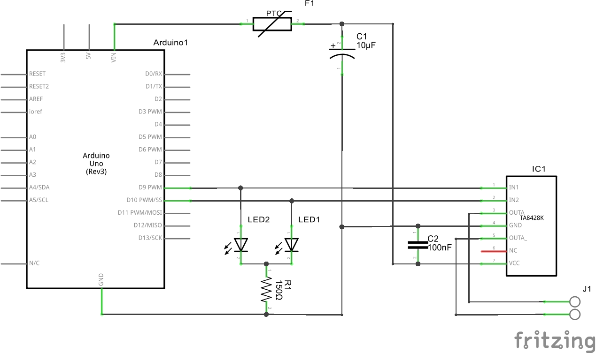
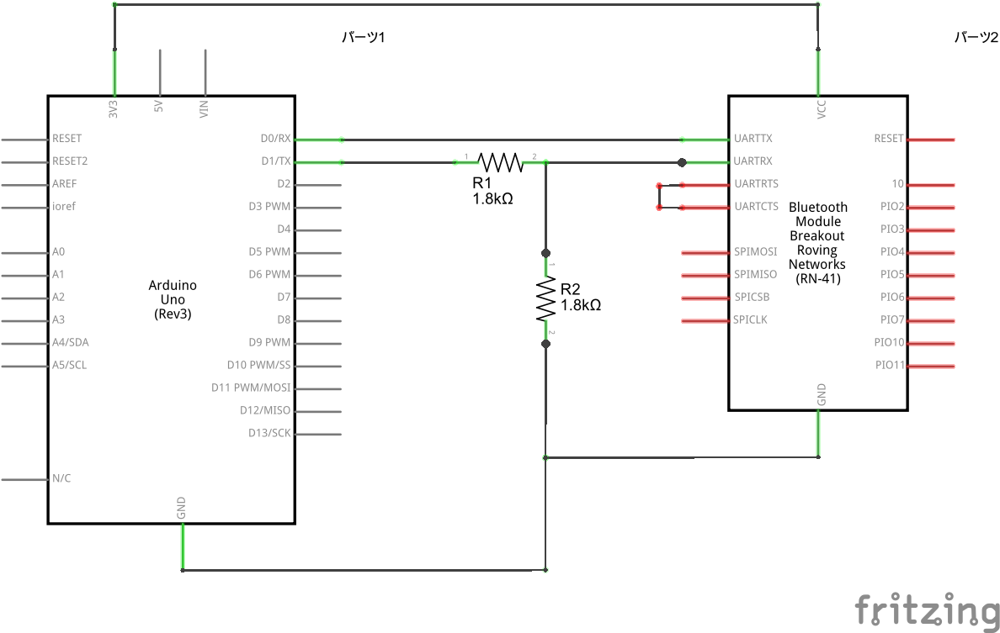
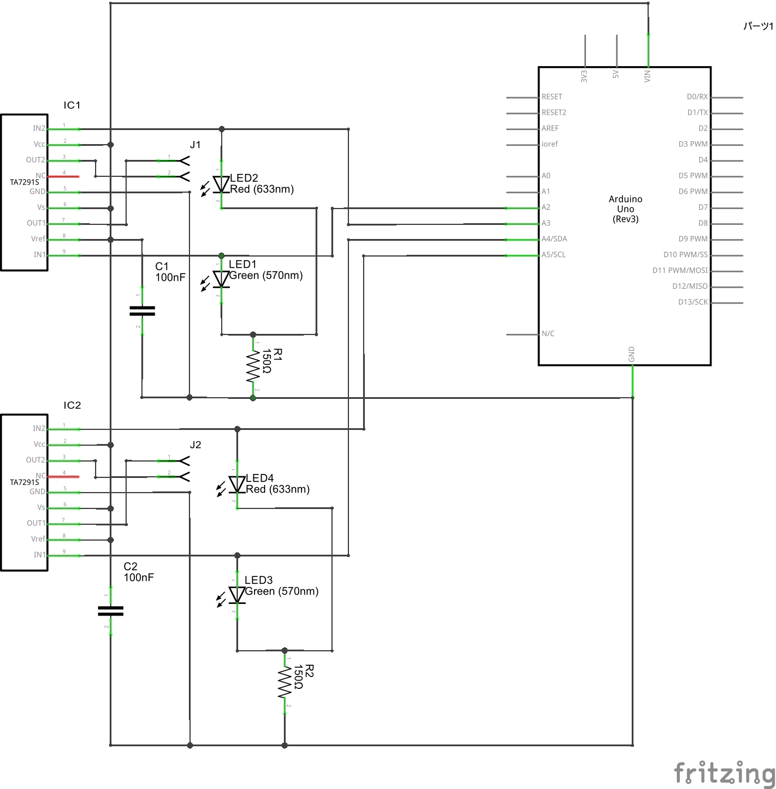

# Serial Train Control

## これは何?

シリアル通信を利用してArduinoと通信を行い、運転台型コントローラを操作して鉄道模型を制御するソフトウェアです。
Bluetoothでの無線通信を想定して開発しましたが、USBによるシリアル通信でも使用できます。

[自サイトの記事](http://kamisawa.net/electronic-kit/bluetooth-railroadmodel/)も参照されたし。

## ファイル構成

- sketch

  Arduino用のスケッチです。このスケッチをArduinoに書き込んで下さい。

- schematic

 Fritzingで作成した回路図です。

- src

 ソースコード一式です。

## 製作が必要な回路
schematicフォルダに下記の回路図が入っています。
本ソフトウェアを使用する際は、この回路図をもとに回路を組み立てる必要があります。
各自で部材調達、組み立てを行って下さい。

### MotorControl(必須)

モータドライバを利用した鉄道模型のモータ制御回路です。
  レールからのフィーダーはピンソケットに差し込んで下さい。

### Bluetooth(無線通信を使用しない場合は不要)

BluetoothモジュールとArduinoの結線方法を示しています。
2mmピッチ変換モジュールを利用した場合、XBeeシールドで代用が可能です。

その場合、CTSとRTSを短絡させるように結線して下さい。

Bluetoothモジュールは日本国内ではRN-42が入手しやすく、価格も安価です。
電波法に抵触するため、必ず[技適を取得したモジュール](http://akizukidenshi.com/catalog/g/gM-08690/)を使用して下さい。

  使用前に、コマンドモードにてモジュールの設定が必要です。
  - スレーブモード
  - SPPプロファイル
  - ボーレート: 115200bps

に設定して下さい。

### PointControl(ポイント制御を行わない場合は不要)

モータドライバを利用した鉄道模型のポイント制御回路です。
ポイントからのフィーダーはピンソケットに差し込んで下さい。

回路図ではA4, A5ピンを利用しています。

スケッチを改造してI2Cを利用する場合はI/Oが競合するため、ピンを変更して下さい。
